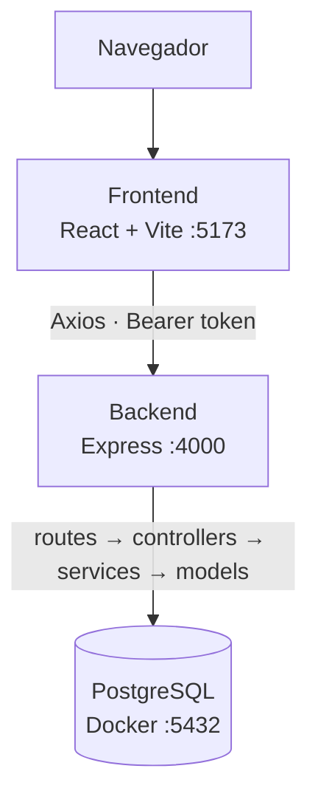

<div align="center">

# 🏟️ Sistema de Reservas — Complejo Deportivo

**Aplicación web para administrar un complejo deportivo:** reserva de canchas, pagos con comprobante, eventos con inscripción de cupo limitado y reportes para administración.


</div>

---

## 📚 Tabla de Contenidos

- 🧱 [Stack Tecnológico](#-stack-tecnológico)
- 📁 [Estructura del Proyecto](#-estructura-del-proyecto)
- 🚀 [Puesta en Marcha](#-puesta-en-marcha)
- 🔑 [Usuarios de Prueba](#-usuarios-de-prueba)
- 🧩 [Servicios Implementados](#-servicios-implementados)
- 🔄 [Arquitectura y Flujo de Comunicación](#-arquitectura-y-flujo-de-comunicación)
- 🛠️ [Comandos Útiles](#-comandos-útiles)
- 📌 [Notas y Pendientes Conocidos](#-notas-y-pendientes-conocidos)

---

## 🧱 Stack Tecnológico

| Capa | Tecnología |
|---|---|
| **Backend** | Node.js 20 · Express 4 · TypeScript |
| **Base de datos** | PostgreSQL 15 vía `pg` (SQL puro, sin ORM) |
| **Autenticación** | JWT (`jsonwebtoken`) + `bcrypt` |
| **Archivos** | `multer` (fotos de perfil y comprobantes) |
| **Correo** | `nodemailer` (Gmail SMTP) |
| **Frontend** | React 18 · Vite · TypeScript |
| **Ruteo** | React Router 7 |
| **Cliente HTTP** | Axios |
| **Estilos** | Tailwind CSS |
| **Gráficas** | `@nivo/heatmap` · `@nivo/pie` |
| **Exportación** | `jsPDF` · `html2canvas` · `xlsx` |
| **Infraestructura** | Docker Compose · pgAdmin 4 |

---

## 📁 Estructura del Proyecto

```text
Sistema de Reservas Complejo deportivo/
├── compose.yaml
├── database/
│   ├── 01_schema.sql        # Tablas, relaciones y restricciones
│   └── 02_inserts.sql       # Datos de prueba (seeders)
├── backend/
│   ├── .env                 # No incluido — se crea localmente
│   ├── Dockerfile
│   ├── uploads/
│   │   ├── perfiles/        # Fotos de perfil
│   │   └── comprobantes/    # Comprobantes de pago
│   └── src/
│       ├── server.ts        # Punto de entrada
│       ├── app.ts           # Configuración de Express y rutas
│       ├── config/          # Conexión a PostgreSQL
│       ├── controllers/     # req/res de cada endpoint
│       ├── services/        # Lógica de negocio (canchas, reservas)
│       ├── models/          # Consultas SQL
│       ├── routes/          # Endpoints de la API
│       ├── middlewares/     # Verificación de JWT y de rol
│       ├── types/ utils/    # Interfaces y validaciones
│       └── documents/       # Peticiones de prueba (REST Client)
└── frontend/
    ├── Dockerfile
    ├── vite.config.ts
    └── src/
        ├── App.tsx / main.tsx   # Rutas y entrada
        ├── context/             # AuthContext (sesión), ThemeContext
        ├── services/api.ts      # Cliente Axios con interceptores
        ├── components/          # canchas/ reservas/ pagos/ eventos/
        │                        # usuarios/ reportes/ layout/ landing/
        └── pages/               # Login, Dashboard, Reportes, etc.
```

> Cada módulo del backend sigue el mismo patrón: `routes → controllers → (services) → models`. Solo **canchas** y **reservas** tienen una capa `services` explícita; el resto llama al modelo directamente desde el controlador.

---

## 🚀 Puesta en Marcha

### Requisitos previos

| Herramienta | Versión |
|---|---|
| Node.js | 20+ |
| Docker Desktop | última estable |
| Git | cualquiera |

### 1️⃣ Clonar el repositorio

```bash
git clone https://github.com/Roberto-Carlos01/Sistema-de-Reservas---Complejo-deportivo-.git
cd Sistema-de-Reservas---Complejo-deportivo-
```

### 2️⃣ Crear las variables de entorno

> [!IMPORTANT]
> El archivo `backend/.env` **no viene incluido en el repositorio** — debes crearlo tú mismo dentro de `backend/`. Los valores de la base de datos ya sirven como ejemplo para Docker; completa tu propio `JWT_SECRET` y tus credenciales de Gmail.

```env
PORT=4000

DB_USER=limber
DB_PASSWORD=123456
DB_HOST=localhost
DB_PORT=5432
DB_NAME=bdcomplejodeportivo

JWT_SECRET=<definir un secreto propio>

EMAIL_USER=<correo Gmail remitente>
EMAIL_PASS=<contraseña de aplicación de Gmail>
FRONTEND_URL=http://localhost:5173
```

### 3️⃣ Levantar el proyecto

<details>
<summary><b>Opción A — Todo con Docker</b></summary>

```bash
docker compose up -d --build
```

Levanta los 4 contenedores. La base de datos se siembra sola con `database/01_schema.sql` y `02_inserts.sql`, pero **solo la primera vez** que se crea el volumen (`docker compose down -v` para reiniciarla desde cero).

</details>

<details>
<summary><b>Opción B — Modo desarrollo</b> (recomendado para programar)</summary>

```bash
# Solo la base de datos
docker compose up -d db

# Base de datos + pgAdmin (interfaz web)
docker compose up -d db pgadmin
```

```bash
# Backend (nueva terminal)
cd backend
npm install
npm run dev
```

```bash
# Frontend (otra terminal)
cd frontend
npm install
npm run dev
```

</details>

| Servicio | URL |
|---|---|
| Frontend | http://localhost:5173 |
| Backend API | http://localhost:4000 |
| Health check | http://localhost:4000/api/health |
| pgAdmin | http://localhost:5050 |

---

## 🔑 Usuarios de Prueba

| Email                           | Contraseña | Rol           |
| ------------------------------- | ---------- | ------------- |
| `carla.mamani@canchasbo.com`    | `Passw123` | Administrador |
| `jorge.fernandez@canchasbo.com` | `Passw123` | Administrador |
| `ana.torrez@canchasbo.com`      | `Passw123` | Empleado      |
| `maria.lopez@gmail.com`         | `Passw123` | Cliente       |

---

## 🧩 Servicios Implementados

| Módulo | Endpoint | Descripción |
|---|---|---|
| 🔐 Autenticación | `/api/auth` | Registro público de clientes, login con JWT (expira en 15 min) y recuperación de contraseña por correo con token temporal. |
| 👤 Usuarios | `/api/usuarios` | Perfil propio (con foto) y, desde el panel admin, listado, creación, edición, cambio de estado y eliminación de usuarios. |
| 🏟️ Canchas | `/api/canchas` | CRUD de canchas (crear/editar/eliminar restringido a administradores) y consulta de reservas por cancha para calcular disponibilidad. |
| 📅 Reservas | `/api/reservas` | Valida que el horario no se solape. Reservas en línea quedan `pendiente`; presenciales, `confirmada`. El cliente cancela solo con +24h de anticipación; solo un admin modifica. |
| 💳 Pagos | `/api/pagos` | Presencial, tarjeta de débito, crédito o QR. Monto = precio por hora × horas. Métodos virtuales exigen comprobante y quedan `pendiente_verificacion` hasta ser aprobados o rechazados. |
| 🎉 Eventos | `/api/eventos` | Admin y empleados crean, editan, reprograman y cancelan eventos. Los clientes se inscriben respetando el cupo, con transacciones SQL. |
| 📊 Reportes | `/api/reportes` | Solo administradores. Pagos por estado/método, mapa de calor de ocupación, horas ocupadas, mayor demanda, rentabilidad de servicios y comportamiento de usuarios. |

---

## 🔄 Arquitectura y Flujo de Comunicación



La sesión se guarda como JWT en `localStorage`. El frontend cierra sesión automáticamente a los 15 minutos de inactividad, y también ante cualquier respuesta `401`/`403` del backend.

---

## 🛠️ Comandos Útiles

```bash
# Logs de la base de datos
docker logs postgres-db-complejo-deportivo

# Reiniciar todo
docker compose down
docker compose up -d

# Reconstruir el backend tras cambiar dependencias
docker compose up -d --build backend
```

---

## 📌 Notas y Pendientes Conocidos

> [!WARNING]
> Puntos a revisar antes de llevar el proyecto a producción.

- **Permisos en `/api/usuarios`:** listar, crear, editar, cambiar estado y eliminar usuarios solo exigen un token válido; falta el middleware `esAdmin` para restringirlos a administradores.
- **`modo_demo` en pagos:** `POST /api/pagos/procesar` acepta un flag `modo_demo` que marca el pago como `pagado` sin comprobante. Solo se desactiva si `NODE_ENV=production`, variable que hoy no está definida ni en `compose.yaml` ni en ningún `.env`.
- **Extras de reserva** (balón, arbitraje, iluminación) se guardan solo en el `localStorage` del navegador; las tablas `utilidad` y `reserva_utilidad` existen en el esquema pero el backend todavía no las usa.
- **Secretos versionados:** `credenciales.txt` y cualquier `.env` que llegues a subir por error pueden incluir credenciales reales, entre ellas una contraseña de aplicación de Gmail. Si el repositorio es público, conviene rotarlas.
- `manual_inicio.md` describe una versión anterior del proyecto (Postgres 16, credenciales `admin/admin1234`, carpeta `frontend/src/iteraciones/`) que ya no coincide con el código actual.

---

<div align="center">

⬆️ [Volver arriba](#-sistema-de-reservas--complejo-deportivo)

</div>